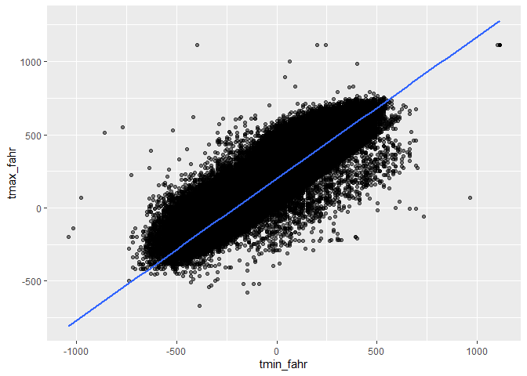
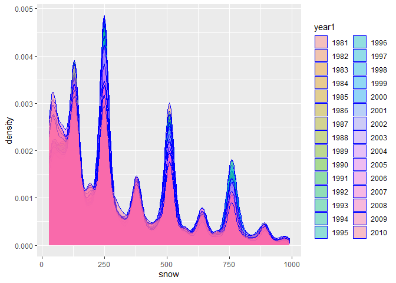

p8105_hw3_zx2425
================

Dowloading packages

### Problem 0

This solution focuses on a reproducible report containing code and text
necessary for Problems 1-3, and is organized as an R Project. This was
not prepared as a GitHub repo; examples for repository structure and git
commits should be familiar from other elements of the course.

Throughout, we use appropriate text to describe our code and results,
and use clear styling to ensure code is readable.

### Problem 1

``` r
data("instacart")

instacart = 
  instacart %>% 
  as_tibble(instacart)
instacart
```

    ## # A tibble: 1,384,617 × 15
    ##    order_id product_id add_to_…¹ reord…² user_id eval_…³ order…⁴ order…⁵ order…⁶
    ##       <int>      <int>     <int>   <int>   <int> <chr>     <int>   <int>   <int>
    ##  1        1      49302         1       1  112108 train         4       4      10
    ##  2        1      11109         2       1  112108 train         4       4      10
    ##  3        1      10246         3       0  112108 train         4       4      10
    ##  4        1      49683         4       0  112108 train         4       4      10
    ##  5        1      43633         5       1  112108 train         4       4      10
    ##  6        1      13176         6       0  112108 train         4       4      10
    ##  7        1      47209         7       0  112108 train         4       4      10
    ##  8        1      22035         8       1  112108 train         4       4      10
    ##  9       36      39612         1       0   79431 train        23       6      18
    ## 10       36      19660         2       1   79431 train        23       6      18
    ## # … with 1,384,607 more rows, 6 more variables: days_since_prior_order <int>,
    ## #   product_name <chr>, aisle_id <int>, department_id <int>, aisle <chr>,
    ## #   department <chr>, and abbreviated variable names ¹​add_to_cart_order,
    ## #   ²​reordered, ³​eval_set, ⁴​order_number, ⁵​order_dow, ⁶​order_hour_of_day

#### Answer questions about the data

This dataset contains 1384617 rows and 15 columns, with each row
resprenting a single product from an instacart order. Variables include
identifiers for user, order, and product; the order in which each
product was added to the cart. There are several order-level variables,
describing the day and time of the order, and number of days since prior
order. Then there are several item-specific variables, describing the
product name (e.g. Yogurt, Avocado), department (e.g. dairy and eggs,
produce), and aisle (e.g. yogurt, fresh fruits), and whether the item
has been ordered by this user in the past. In total, there are 39123
products found in 131209 orders from 131209 distinct users.

Below is a table summarizing the number of items ordered from aisle. In
total, there are 134 aisles, with fresh vegetables and fresh fruits
holding the most items ordered by far.

``` r
instacart %>% 
  count(aisle) %>% 
  arrange(desc(n))
```

    ## # A tibble: 134 × 2
    ##    aisle                              n
    ##    <chr>                          <int>
    ##  1 fresh vegetables              150609
    ##  2 fresh fruits                  150473
    ##  3 packaged vegetables fruits     78493
    ##  4 yogurt                         55240
    ##  5 packaged cheese                41699
    ##  6 water seltzer sparkling water  36617
    ##  7 milk                           32644
    ##  8 chips pretzels                 31269
    ##  9 soy lactosefree                26240
    ## 10 bread                          23635
    ## # … with 124 more rows

Next is a plot that shows the number of items ordered in each aisle.
Here, aisles are ordered by ascending number of items.

``` r
instacart %>% 
  count(aisle) %>% 
  filter(n > 10000) %>% 
  mutate(aisle = fct_reorder(aisle, n)) %>% 
  ggplot(aes(x = aisle, y = n)) + 
  geom_point() + 
  labs(title = "Number of items ordered in each aisle") +
  theme(axis.text.x = element_text(angle = 60, hjust = 1))
```

<!-- -->

Our next table shows the three most popular items in aisles
`baking ingredients`, `dog food care`, and `packaged vegetables fruits`,
and includes the number of times each item is ordered in your table.

``` r
instacart %>% 
  filter(aisle %in% c("baking ingredients", "dog food care", "packaged vegetables fruits")) %>%
  group_by(aisle) %>% 
  count(product_name) %>% 
  mutate(rank = min_rank(desc(n))) %>% 
  filter(rank < 4) %>% 
  arrange(desc(n)) %>%
  knitr::kable()
```

| aisle                      | product_name                                  |    n | rank |
|:---------------------------|:----------------------------------------------|-----:|-----:|
| packaged vegetables fruits | Organic Baby Spinach                          | 9784 |    1 |
| packaged vegetables fruits | Organic Raspberries                           | 5546 |    2 |
| packaged vegetables fruits | Organic Blueberries                           | 4966 |    3 |
| baking ingredients         | Light Brown Sugar                             |  499 |    1 |
| baking ingredients         | Pure Baking Soda                              |  387 |    2 |
| baking ingredients         | Cane Sugar                                    |  336 |    3 |
| dog food care              | Snack Sticks Chicken & Rice Recipe Dog Treats |   30 |    1 |
| dog food care              | Organix Chicken & Brown Rice Recipe           |   28 |    2 |
| dog food care              | Small Dog Biscuits                            |   26 |    3 |

Finally is a table showing the mean hour of the day at which Pink Lady
Apples and Coffee Ice Cream are ordered on each day of the week. This
table has been formatted in an untidy manner for human readers. Pink
Lady Apples are generally purchased slightly earlier in the day than
Coffee Ice Cream, with the exception of day 5.

``` r
instacart %>%
  filter(product_name %in% c("Pink Lady Apples", "Coffee Ice Cream")) %>%
  group_by(product_name, order_dow) %>%
  summarize(mean_hour = mean(order_hour_of_day)) %>%
  spread(key = order_dow, value = mean_hour) %>%
  knitr::kable(digits = 2)
```

    ## `summarise()` has grouped output by 'product_name'. You can override using the
    ## `.groups` argument.

| product_name     |     0 |     1 |     2 |     3 |     4 |     5 |     6 |
|:-----------------|------:|------:|------:|------:|------:|------:|------:|
| Coffee Ice Cream | 13.77 | 14.32 | 15.38 | 15.32 | 15.22 | 12.26 | 13.83 |
| Pink Lady Apples | 13.44 | 11.36 | 11.70 | 14.25 | 11.55 | 12.78 | 11.94 |

\###problem2 \##introduce the dataset

``` r
library("p8105.datasets")
acc=read_csv("C:/Users/10145/Desktop/p8105_hw2_zx2425(1)/p8105_hw3_zx2425/p8105_hw3_zx2425/accel_data.csv")
```

    ## Rows: 35 Columns: 1443
    ## ── Column specification ────────────────────────────────────────────────────────
    ## Delimiter: ","
    ## chr    (1): day
    ## dbl (1442): week, day_id, activity.1, activity.2, activity.3, activity.4, ac...
    ## 
    ## ℹ Use `spec()` to retrieve the full column specification for this data.
    ## ℹ Specify the column types or set `show_col_types = FALSE` to quiet this message.

``` r
acc = acc %>% 
  janitor::clean_names()
acc
```

    ## # A tibble: 35 × 1,443
    ##     week day_id day      activ…¹ activ…² activ…³ activ…⁴ activ…⁵ activ…⁶ activ…⁷
    ##    <dbl>  <dbl> <chr>      <dbl>   <dbl>   <dbl>   <dbl>   <dbl>   <dbl>   <dbl>
    ##  1     1      1 Friday      88.4    82.2    64.4    70.0    75.0    66.3    53.8
    ##  2     1      2 Monday       1       1       1       1       1       1       1  
    ##  3     1      3 Saturday     1       1       1       1       1       1       1  
    ##  4     1      4 Sunday       1       1       1       1       1       1       1  
    ##  5     1      5 Thursday    47.4    48.8    46.9    35.8    49.0    44.8    73.4
    ##  6     1      6 Tuesday     64.8    59.5    73.7    45.7    42.4    58.4    76.8
    ##  7     1      7 Wednesd…    71.1   103.     68.5    45.4    37.8    18.3    27.5
    ##  8     2      8 Friday     675     542    1010     779     509     106     637  
    ##  9     2      9 Monday     291     335     393     335     263     675     213  
    ## 10     2     10 Saturday    64      11       1       1       1       1       1  
    ## # … with 25 more rows, 1,433 more variables: activity_8 <dbl>,
    ## #   activity_9 <dbl>, activity_10 <dbl>, activity_11 <dbl>, activity_12 <dbl>,
    ## #   activity_13 <dbl>, activity_14 <dbl>, activity_15 <dbl>, activity_16 <dbl>,
    ## #   activity_17 <dbl>, activity_18 <dbl>, activity_19 <dbl>, activity_20 <dbl>,
    ## #   activity_21 <dbl>, activity_22 <dbl>, activity_23 <dbl>, activity_24 <dbl>,
    ## #   activity_25 <dbl>, activity_26 <dbl>, activity_27 <dbl>, activity_28 <dbl>,
    ## #   activity_29 <dbl>, activity_30 <dbl>, activity_31 <dbl>, …

The demensions of the raw dataset is `1443` \* `35`. It contains the
each minute of activity by days and its costs orginized by wide format.

\#clean the dataset

``` r
acc = acc %>%   
  mutate(weedd = case_when(
    day == "Monday" | day=="Tuesday" | day=="Wednesday" | day == "Thursday"| day == "Friday" ~ "weekday",
    day == "Saturday"|day=="Sunday" ~ "weekend" ,
    TRUE     ~ "" ))
acc = acc %>% 
      mutate(
    sum=rowSums(.[4:1443])
  )
acc=acc %>% 
  pivot_longer(activity_1:activity_1440,names_to="act",values_to="cc") 
acc=acc %>% 
separate(act, into = c("activity_name", "minute")) %>%
  mutate(
    minute=as.numeric(minute)
  ) %>% 
select(-activity_name)
acc
```

    ## # A tibble: 50,400 × 7
    ##     week day_id day    weedd       sum minute    cc
    ##    <dbl>  <dbl> <chr>  <chr>     <dbl>  <dbl> <dbl>
    ##  1     1      1 Friday weekday 480543.      1  88.4
    ##  2     1      1 Friday weekday 480543.      2  82.2
    ##  3     1      1 Friday weekday 480543.      3  64.4
    ##  4     1      1 Friday weekday 480543.      4  70.0
    ##  5     1      1 Friday weekday 480543.      5  75.0
    ##  6     1      1 Friday weekday 480543.      6  66.3
    ##  7     1      1 Friday weekday 480543.      7  53.8
    ##  8     1      1 Friday weekday 480543.      8  47.8
    ##  9     1      1 Friday weekday 480543.      9  55.5
    ## 10     1      1 Friday weekday 480543.     10  43.0
    ## # … with 50,390 more rows

### Answering the question resulting dataset

The dimension of the resulting data set is `7` \* `50400`. It has been
translated to long format data frame which means the activity variables
are represented by the time that the action is issued and its costs.
Also, there is a ‘weedd’ variable represent the type of one day (weekend
or not). Furthermore, we sum of one day’s activity that showed in the
sum variable.

\##analysis the sum of activity

``` r
acc_sum <- unique(data.frame('day' = acc$day_id, 
                      'counts'=acc$sum))
ggplot(acc_sum, aes(x = day, y = counts)) + 
  geom_point()  
```

<!-- -->

\##Answering questions about the trends This part calculate the total
counts for each day, and draw a plot to find if there are any trends for
each day’s activity. The results show that there are not apparent trend.
However, during the 10\~30 days, there are more regular activities done
than at the begining and in the end of those days.

\##arrange the order and make a plot

``` r
acc_ar=acc %>% 
  arrange(day_id)
acc_ar
```

    ## # A tibble: 50,400 × 7
    ##     week day_id day    weedd       sum minute    cc
    ##    <dbl>  <dbl> <chr>  <chr>     <dbl>  <dbl> <dbl>
    ##  1     1      1 Friday weekday 480543.      1  88.4
    ##  2     1      1 Friday weekday 480543.      2  82.2
    ##  3     1      1 Friday weekday 480543.      3  64.4
    ##  4     1      1 Friday weekday 480543.      4  70.0
    ##  5     1      1 Friday weekday 480543.      5  75.0
    ##  6     1      1 Friday weekday 480543.      6  66.3
    ##  7     1      1 Friday weekday 480543.      7  53.8
    ##  8     1      1 Friday weekday 480543.      8  47.8
    ##  9     1      1 Friday weekday 480543.      9  55.5
    ## 10     1      1 Friday weekday 480543.     10  43.0
    ## # … with 50,390 more rows

``` r
ggplot(acc, aes(x = minute, y = cc , color=day)) + 
  geom_point()  
```

<!-- -->
\##Answering questions It we focus on the distribution of daily points
and ignore the difference among weekdays, it shows that athletes are
more active during at time of a day and the ending of a day. If compared
different days during the week, we can see most of the outline of the
figure is composed by green and red points, which possibly means that
people are more active during weekend. We can conclude that for the
patients, they keep an eye on their daily sport. And individuals always
do more excercise at the morning, noon and evening of a day. They are
more likely to get high level of activity during weekend.

\###problem3 \##introduce data

``` r
library(p8105.datasets)
data("ny_noaa")
nynoaadat=ny_noaa
```

Firstly, the data frame contains 2595176 objects and 7 variables.
Variables include id, date, prcp, snow, snwd, tmax, tmin  
So the next step lets organize the data set and have a outlook.

``` r
nynoaadat = separate(nynoaadat,date, into= c("year","month",'day'),sep= "-")

nynoaadat=mutate(
  nynoaadat, year=as.numeric(year),month=as.numeric(month),day=as.numeric(day))
```

The resulting dataset is 2595176 \* 9. The new variables are ‘year’,
‘month’ and ‘day’ which is extract by the data variable. The day_id mark
a unique day. And the ‘prep’,‘snow’, ‘snwd’, are represent the weather
condition which have different measurement.

So next, Let’s unified the measurement standard of ‘prep’, ‘snow’,
‘snwd’ and see the frequency of the ‘snow’.

``` r
nynoaadat=nynoaadat %>% 
  mutate(
   prcp=prcp/10,
   tmax=as.numeric(tmax)/10,
   tmin=as.numeric(tmin)/10
  )
nyno_fre=as.data.frame(table(nynoaadat$snow))
```

## Answering the questions

First, we divide 10 to each variable of ‘prcp’,‘tmin’ and ‘tmax’. At the
same time, after viewing the frequency table of snow we can see the
value of 0 is significantly larger than other values, This possibly
because the possible of the snow of the city is low. Besides, we are
comparing the frequency of no snow with the frequency of snow at a
certain level at the city.

## 
