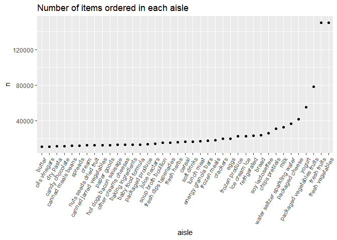

Simple document
================

P2.1 \# clean dataset

``` r
library("p8105.datasets")
acc=read_csv("C:/Users/10145/Desktop/DS project/P8105_hw3_zx2425/ZiJian-zx2425/accel_data.csv")
```

    ## Rows: 35 Columns: 1443
    ## ── Column specification ────────────────────────────────────────────────────────
    ## Delimiter: ","
    ## chr    (1): day
    ## dbl (1442): week, day_id, activity.1, activity.2, activity.3, activity.4, ac...
    ## 
    ## ℹ Use `spec()` to retrieve the full column specification for this data.
    ## ℹ Specify the column types or set `show_col_types = FALSE` to quiet this message.

``` r
acc = acc %>% 
  janitor::clean_names() 
acc = acc %>%   
  mutate(weedd = case_when(
    day == "Monday" | day=="Tuesday" | day=="Wednesday" | day == "Thursday"| day == "Friday" ~ "weekday",
    day == "Saturday"|day=="Sunday" ~ "weekend" ,
    TRUE     ~ "" ))
acc = acc %>% 
      mutate(
    sum=rowSums(.[4:1443])
  )
acc=acc %>% 
  pivot_longer(activity_1:activity_1440,names_to="act",values_to="cc") 
acc=acc %>% 
separate(act, into = c("activity_name", "minute")) %>%
  mutate(
    minute=as.numeric(minute)
  ) %>% 
select(-activity_name)
```

\#arrange the order and make a plot

``` r
acc_ar=acc %>% 
  arrange(day_id)
ggplot(acc, aes(x = minute, y = cc , color=day)) + 
  geom_point()  
```

<!-- -->
